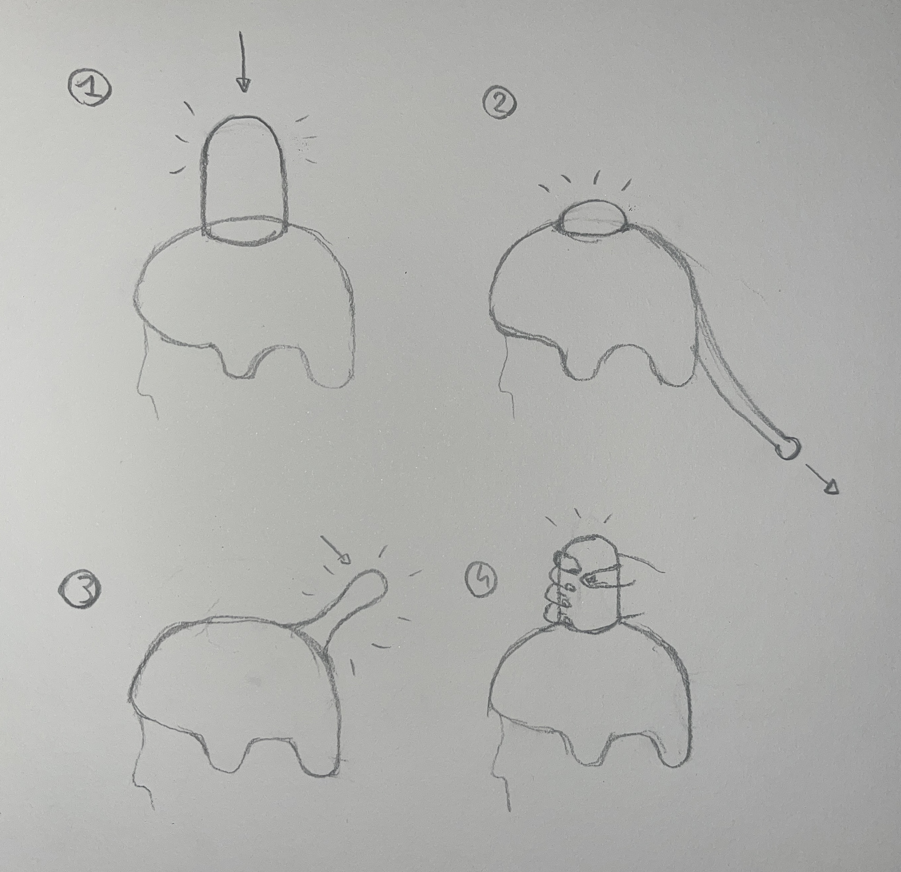

# Projecttitel
*Nature & Play: kampkode* 

*Projectteam: Robbe De Guytenaer; Kai Cherchye*

*2023 - 2024*

## Samenvatting
In de hedendaagse samenleving spenderen de meeste kinderen meer tijd binnenshuis dan buitenshuis, wat kan leiden tot diverse gezondheidsproblemen zoals bijziendheid, overgewicht, verminderde motorische ontwikkeling, rug-, nek- en schouderklachten, slaapproblemen en psychosociale problemen. Ons onderzoek, gebaseerd op interviews met de doelgroep, online bronnen en nieuwsartikelen die deze kwesties belichten, bevestigen deze zorgwekkende trends.

Als reactie hierop hebben we een innovatieve oplossing bedacht: de ontwikkeling van een digitale helm die het buiten spelen aantrekkelijker maakt en kinderen motiveert om meer tijd in de buitenlucht door te brengen. Deze helm is ontworpen met als doel niet alleen de fysieke activiteit te bevorderen, maar ook het plezier en de interesse van kinderen in buitenspelen te vergroten. 

  
  
  
  

## Introductie
In toenemende mate blijkt dat kinderen minder tijd doorbrengen in de buitenomgeving. Volgens de bevindingen van 'Het Grote Buitenspeelonderzoek' uit 2019 is er een afname van 37% in buitenspelactiviteiten onder kinderen ten opzichte van 2008 (Meire & Kind & Samenleving, 2020). Deze ontwikkeling kan voornamelijk worden toegeschreven aan de digitalisering van binnenspeelgoed, terwijl buitenspeelgoed deze trend niet heeft gevolgd. Het digitaliseren van speelgoed voor binnenshuis oefent een grotere aantrekkingskracht uit op kinderen dan het traditionele speelgoed, wat resulteert in een toenemende neiging om binnen te blijven en minder buiten te spelen.
Recentelijk onderzoek in Nederland ondersteunt deze bevindingen en benadrukt dat de voornaamste reden voor het verminderde buitenspelen van kinderen te wijten is aan de digitale speelmogelijkheden binnenshuis, met name gericht op gaming en sociale media (Kantar Public & Jantje Beton, 2022). Het is echter bekend dat buitenspelen van aanzienlijk belang is voor de gezonde ontwikkeling van een kind. Onvoldoende blootstelling aan buitenspel kan talloze nadelige gevolgen hebben voor het volwassen leven van een individu.
In dit kader streven wij ernaar een bijdrage te leveren aan het stimuleren van buitenspelactiviteiten, met als doel deze activiteiten even aantrekkelijk, zo niet aantrekkelijker, te maken voor kinderen. Onze benadering omvat de ontwikkeling van een innovatief product, met de eigenschap zowel de interesse van kinderen te wekken als niet te zeer af te leiden. Hierbij maken wij gebruik van het concept 'gamification', waarbij elementen die digitale games aantrekkelijk maken, worden geïntegreerd in niet-digitale activiteiten, zoals buitenspelen.
Gamification, met zijn focus op competitie, samenwerking en beloning, biedt de mogelijkheid om buitenspelen aantrekkelijker te maken voor kinderen die zijn opgegroeid met deze elementen als integraal onderdeel van hun dagelijkse leven. Met andere woorden is gamification een belangrijk aspect van producten voor kinderen die opgegroeid zijn met digitale games en sociale media. Onze missie is om deze elementen op een doordachte manier te implementeren in een product, zodat kinderen worden gestimuleerd om vaker buiten te spelen, en daarmee een gezonde ontwikkeling te bevorderen.

  

## Methdologie
In de initiële fase van ons project werden ons drie verschillende projecten voorgelegd waaruit we de opdracht "Nature, play & tech" hebben gekozen. Gedurende het resterende jaar zullen we ons hierop concentreren. Na het ontvangen van de opdracht hebben we een onderzoek gedaan naar het bestaande probleem en de bijbehorende oorzaken. We hebben daarbij gebruikgemaakt van artikelen en onderzoeken op het internet verder werd er ook gebruikgemaakt van methoden zoals de root-cause analysis en het WWWWWH-model.

Vervolgens hebben we strategieën gebruikt zoals benchmarking, problem-solution matrix en gebruikersonderzoek om mogelijke oplossingen voor het geïdentificeerde probleem te verkennen. Tijdens de ideegeneratie fase hebben we gebrainstormd en een selectie gemaakt uit de vele ideeën. Dit leidde tot het bepalen van één specifiek concept waaraan we verder zouden werken, namelijk 'KampKode'.

In de 'Concept verder werken'-fase hebben we het gekozen concept geanalyseerd door het te verdelen in belangrijke en minder belangrijke factoren. Hierbij hebben we meerdere opties voor elk aspect overwogen en een morfologische kaart gemaakt. Op basis hiervan hebben we enkele concepten geschetst om de richting van ons project te bepalen.
Vervolgens zijn we overgegaan naar de volgende fase, waarin we een eerste prototype hebben ontwikkeld. Ons gekozen concept omvatte een helm met een knop gemaakt uit schuim, ondersteund door eenvoudige Arduino-code om de visuele aspecten te verbeteren.

Bij het afronden van het eerste semester hebben we een eerste verslag opgesteld, waarin we onze voortgang tot dan toe hebben gedocumenteerd en onze bevindingen hebben gepresenteerd. Deze verslaglegging geeft een overzicht van de stappen die we hebben genomen en de ontwikkeling van ons project tot dusver.

## Discovery

### Doestellingen
Ons voornaamste doel is het creëren van het eerste prototype en het testen van de initiële ideeën voor het uitschakelen van spelers. We hebben op dit moment twee voorlopige opties bedacht: het integreren van een drukknop op de helm of het bevestigen van een staart aan de achterkant van de helm. Het uitvoeren van tests is van essentieel belang om een dieper begrip te krijgen van de aspecten die mogelijk aanpassing behoeven. Het ontvangen advies van studenten uit Gent heeft de nadruk gelegd op de noodzaak om rekening te houden met kinderen met beperkingen.
### Materiaal & methoden
- knowledge templates: persona, WWWWWH-model
- literatuuronderzoek: artikelen en onderzoeken op het internet
- benchmarking
- eerste prototype

### Resultaten
De discovery fase startte met een grondige analyse van onze doelgroep, waarbij we gebruikmaken van knowledge templates zoals het opstellen van een persona en het WWWWWH-model. Hierbij lag de focus op het begrijpen van het gedrag en de interesses van de doelgroep.

Vervolgens werd het probleem nader onderzocht, waarbij we de mogelijke redenen en gevolgen ervan analyseerden door middel van literatuuronderzoek. We doorzochten diverse artikelen en onderzoeken online, waaruit bleek dat het probleem expliciet aangepakt moet worden om kinderen aan te moedigen om buiten te spelen.

Het bestaande marktonderzoek werd uitgevoerd met behulp van benchmarking, waarbij we de positieve en negatieve aspecten van reeds bestaande ontwerpen onderzochten. Door gebruik te maken van een problem-solution matrix brachten we de problemen en bestaande oplossingen in kaart.

Het eerste prototype bestaat uit een helm met een lamp gemaakt uit schuim bovenop en een staart aan de achterkant. Dit tastbare beeld geeft ons waardevolle inzichten in hoe deze elementen zich in de praktijk manifesteren. We hebben succesvol een led aan de helm bevestigd, aangestuurd door Arduino. Een drukknop onder de schuimen lamp activeert de led bij indrukken, terwijl het trekken aan de staart hetzelfde effect heeft. Deze positieve testresultaten markeren een vooruitgang richting ons doel en bieden waardevolle informatie voor verdere optimalisatie van het ontwerp en de functionaliteiten.

Tijdens het testen ontstond echter een zorg met betrekking tot veiligheid. Als kinderen te hard slaan op de helm, bestaat het risico op letsel. Om dit aan te pakken, overwegen we alternatieve methoden voor het activeren van het uitschakelmechanisme, zoals schokdempers of het afneembaar maken van de knop. Deze overwegingen zijn van essentieel belang om een veilige speelervaring te waarborgen.

Deze bevindingen en aanvullende overwegingen zullen leiden tot verdere aanpassingen en verbeteringen in het ontwerpproces, en benadrukken het belang van continue evaluatie en innovatie in ons project.

### Conclusies & implicaties
In de onderzoeksfase hebben we geïdentificeerd wat de belangrijkste factoren zijn die kinderen weerhouden om buiten te spelen, en tevens onderzocht welke strategieën ontwerpers hanteren om toch de betrokkenheid van kinderen in buitenactiviteiten te vergroten. Deze bevindingen hebben ons een initiële inzage gegeven in de doelen die we moeten nastreven. 

Ons einddoel in deze fase van het creëren van het eerste prototype en het testen van de uitschakelmethode heeft geleid tot waardevolle inzichten en verschillende resultaten. Het gebruik van schuim als primair materiaal en leds voor verlichting, gebaseerd op zorgvuldige overwegingen en suggesties van studenten uit Gent, heeft zich bewezen als effectief en kostenefficiënt.

Tijdens de tests rees een zorg omtrent veiligheid, met name het risico op letsel als gevolg van te hard slaan op de helm. Om dit aan te pakken, overwegen we alternatieve activeringsmethoden zoals schokdempers of het afneembaar maken van de knop. Deze overwegingen zijn cruciaal om een veilige speelervaring te waarborgen, met name voor kinderen met beperkingen, zoals benadrukt door het ontvangen advies.

Deze bevindingen resulteren in de noodzaak van verdere aanpassingen en verbeteringen in ons ontwerpproces. De implicaties benadrukken het belang van continue evaluatie en innovatie om een veilige, inclusieve en interactieve speelervaring voor kinderen te bereiken.

## Definition
### Doestellingen
Met deze test wilden we achterhalen hoe spelers elkaar in het spel kunnen uitschakelen. Het basisconcept omvat de helm, een lamp en een methode om uitgeschakeld te worden. Hoewel er meerdere manieren zijn om dit te doen, verschilt de effectiviteit. Diverse factoren spelen hierbij een rol, waaronder uitstraling, veiligheid, efficiëntie en prijs.

We dachten na over vier basisconcepten omtrent uitschakeling van een speler:

1. Uitschakeling door op de lamp te drukken, ergens op de helm geplaatst.
2. Achteraan de helm hangt een staart waarmee de speler wordt uitgeschakeld bij het trekken eraan, met een extra lamp elders op de helm.
3. De helm heeft een 'flexibele lamp' waarmee de speler wordt uitgeschakeld bij aanraking door een tegenstander.
4. Een afneembare lamp, bijvoorbeeld bevestigd via magneten, die de speler uitschakelt wanneer deze van de helm wordt getrokken.

Deze concepten worden visueel weergegeven in Figuur 3. Elk concept heeft zijn voor- en nadelen. Door ze aan derden voor te leggen, streven we naar een objectief oordeel over welke methode mogelijk het beste is.

### Materiaal & methoden
Vanuit de 'discovery'-fase hadden we al een ruw prototype van een helm, vergezeld van een lamp en Arduino-besturing van een led-licht. Voor deze test ontwikkelden we diverse lampen van schuim met verschillende vormen. Door de verschillende lampen op diverse locaties te combineren met de helm, verkregen we een visueel beeld van de mogelijke posities voor de lamp. Op deze manier ontstonden tal van opties die we aan onze testpersonen konden presenteren.
De test werd uitgevoerd bij twee broers van Robbe, respectievelijk 7 en 12 jaar oud, dus beide binnen onze doelgroep van 6-12 jaar. We toonden hen de helm en bespraken onze initiële ideeën met betrekking tot de uitschakelmechanismen, waarbij we ook de verschillende prototypes van de lampen toonden. Bij elk uitgedacht uitschakelmechanisme (1-4, zie ‘doelstellingen’) moesten ze de lampen combineren met de helm terwijl ze hardop deelden wat ze dachten. Deze aanpak kan worden beschouwd als een variant van 'contextual inquiries'.

### Resultaten
We zullen hier de resultaten bespreken van de test, per initieel idee (puntjes 1-4 in het deel ‘doelstellingen’). In onderstaande resultaten wordt soms gerefereerd naar lampen A, B, C, D en E die in Figuur 4 te vinden zijn.

**1. Uitschakelen door drukken op de lamp bovenaan**

Dit was meteen een van de favorieten omwille van het uitzicht, maar er waren enkele bedenkingen. Zo is het mogelijk dat kinderen te hard op de lamp gaan slaan waardoor de persoon die de helm draagt zich bezeerd. Dit kan grotendeels opgelost worden door een veersysteem, maar niet helemaal. Verder is het wel een goed systeem om uitgeschakeld te worden, en makkelijk te realiseren. Voor deze toepassing kunnen lampen A, B en E worden gebruikt, en ze zouden bovenaan of achteraan kunnen worden geplaatst.

**2. Uitschakelen door trekken aan staart**

Het trekken aan een staart (die aan de achterkant van de helm hangt) kan op zich ook voor problemen zorgen als deze niet afneembaar is. Het hoofd kan daardoor naar achter worden getrokken, wat tot letsels kan leiden. Ook is het moeilijk om hier een ‘mooi’ product van te maken. Je zal telkens een loshangend deel hebben aan de helm. Dit slaat minder aan dan wanneer enkel de lamp op de helm staat. Een voordeel aan de staart is dat hij lager hangt dan het hoofd, wat betekent dat kleine kinderen ook makkelijker grotere kinderen kunnen uitschakelen. Lampen A en B zijn voor dit systeem ideaal. Ze moeten wel bovenop de helm staan.

**3. Uitschakelen door tikken ‘flexibele lamp’**

Deze optie viel ook in de smaak. Het aantikken van de lamp in actie is leuk en spannend. Indien men per ongeluk te hard zou slaan zou dit in principe niet veel kwaad kunnen voor het kind dat de helm draagt. Het is eerder een dwarskracht dan een axiale kracht, zoals bij (1) het geval is. De lamp zou ook vanachter laag kunnen hangen zodat rekening gehouden wordt met kleine kinderen. Een uitdaging bij dit ontwerp is het mechanisme dat detecteert wanneer het wordt aangetikt. Het zou dan een ‘tik’ moeten registreren vanaf een bepaalde kracht overschreden is. Echter kan het zijn dat dit mechanisme ook ‘tikken’ registreert wanneer er veel actie is in het spel. Het is dus een grotere uitdaging om dit correct te doen werken. Qua vorm van de lamp zouden B, C en D hier ideaal zijn. Deze kunnen in principe overal op de helm worden bevestigd.

**4. Uitschakelen door afnemen lamp**

Dit is de veiligste van de vier. Doordat er hier niet met ‘slaan’ of ‘tikken’ of ‘trekken’ wordt gewerkt, en de lamp gewoon moet worden vastgenomen om de speler uit te schakelen, zullen bij dit systeem de minste ongevallen gebeuren. Het systeem is redelijk simpel te maken. De lamp en de helm blijven aan elkaar met een magneet die sterk genoeg is om ze aan elkaar te houden bij actie, maar ook zwak genoeg is om ze er makkelijk van te trekken. Het enige dat bij dit systeem een probleem is, is dat de helm uit meerdere delen bestaat. Er moet dan een oplossing worden gevonden op wat er gebeurt met de lamp wanneer deze van een helm wordt getrokken.

  

### Conclusies & implicaties
Er werden meerdere concepten besproken, elk met hun eigen voor- en nadelen. De twee testpersonen gaven eerlijk aan wat ze dachten, en wij hebben het in een samenvatting gegoten met aanvullende conclusies. 
Een belangrijke factor is de veiligheid. We willen iets maken dat kinderen leuk vinden om te spelen, en waar er zo weinig mogelijk risico is op gevaar. Bij concept (1) en (2) is de kans groot dat kinderen zich gaan bezeren wanneer ze even onvoorzichtig zijn en te veel opgaan in het spel. Zelfs met pompsystemen om de schok te verminderen bij een slag op de knop of trek aan de staart, is de schok nooit helemaal gedempt. Concept (3) en (4) daarentegen zijn wel veilig uit te voeren wanneer het systeem geoptimaliseerd wordt. Daarom besloten we met deze twee verder te gaan, en de minpuntjes besproken in ‘Resultaten’ aan te pakken in de volgende fase. De lampen per concept staan nog niet vast. 

## Bill of materials
- Led’s
- Schuim (voor knoppen en eventueel andere onderdelen)
- Arduino-componenten
- Bevestigingsmateriaal (lijm, plakband, tandenstokers)
- Draden
- Helm
- Magneet

## Kritische reflectie
In de initiële fase van ons project hebben we uitgebreid onderzoek gedaan naar het probleem dat we willen aanpakken, waardoor we een solide basis hebben gelegd voor verdere ontwikkeling. Echter, bij het brainstormen hebben we ons onvoldoende gericht op diverse aspecten, zoals de behoeften van mensen met beperkingen en financiële overwegingen. Gelukkig hebben de inzichten van de groep uit Gent ons geholpen deze belangrijke overwegingen alsnog te integreren.
Het proces van het maken van het prototype is niet zonder uitdagingen geweest. We zijn laat begonnen, wat resulteerde in beperkte mogelijkheden voor interviews en gebruikerstesten. Dit beïnvloedde onze diepgaande analyse van het ontwerp en de functionaliteiten. Tijdens het prototypeproces werden problemen en mogelijkheden duidelijk die we bij het brainstormen over het hoofd hadden gezien. Het is duidelijk geworden dat een vroegtijdige start met een rudimentair prototype waardevoller zou zijn geweest, waardoor we eerder tastbare inzichten hadden kunnen verkrijgen.
De kritische reflectie op ons proces benadrukt het belang van een meer holistische brainstorming, waarbij diverse perspectieven en mogelijke uitdagingen vanaf het begin worden overwogen. Daarnaast onderstreept het de noodzaak om tijdig te beginnen met het ontwikkelen van een eenvoudig prototype, zodat potentiële problemen en kansen vroegtijdig aan het licht komen. Deze inzichten zullen dienen als waardevolle lessen voor toekomstige projecten en iteraties.

## Bronnen
Meire, J. & Kind & Samenleving. (2020). *Het grote buitenspeelonderzoek.* https://k-s.be/medialibrary/purl/nl/6626949/Het%20grote%20buitenspeelonderzoek.pdf

Kantar Public & Jantje Beton. (2022). *Onderzoek buitenspelen 2022.* https://jantjebeton.nl/uploads/downloads/onderzoek-buitenspelen-2022-62a06183eb380.pdf
